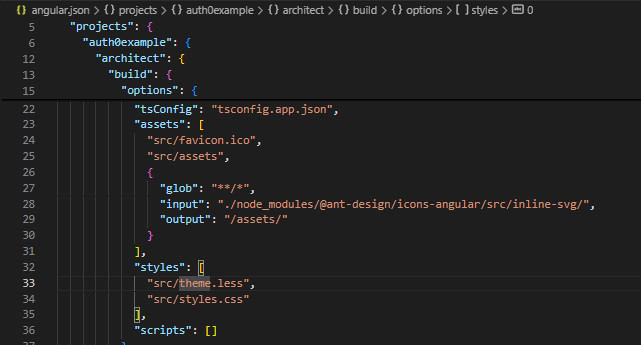
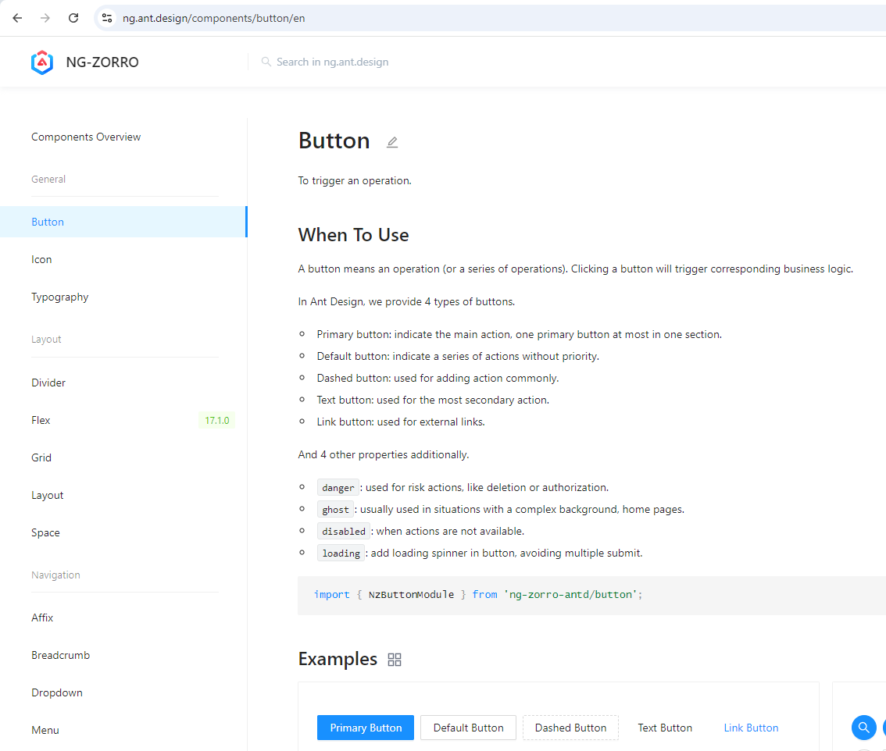
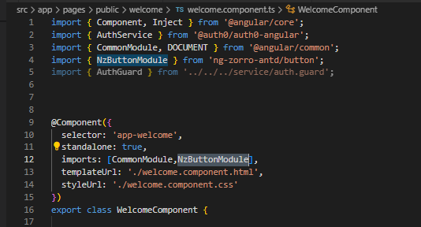

# NG-ZORRO 
Es una biblioteca de componentes UI (interfaz de usuario) para Angular, basada en el popular framework de diseño Ant Design. Proporciona una colección de componentes preconstruidos que cumplen con principios de diseño consistentes y modernos, lo que facilita la creación de aplicaciones web atractivas y funcionales. NG-ZORRO está optimizado específicamente para Angular y sigue las mejores prácticas del framework.

Características principales de NG-ZORRO:  
- Componentes listos para usar: Incluye una amplia variedad de componentes como botones, tablas, formularios, modales, menús, iconos, etc., que se pueden utilizar de inmediato.
- Altamente personalizable: Los estilos y la apariencia de los componentes son personalizables, lo que permite adaptarlos a las necesidades específicas de cada aplicación.
- Basado en Ant Design: Sigue los principios de diseño de Ant Design, que es un sistema de diseño de interfaz de usuario muy popular en el desarrollo de aplicaciones web.
- Compatible con Angular: Está diseñado para integrarse completamente con Angular, aprovechando características como la inyección de dependencias, componentes, directivas, y más.
- Soporte de internacionalización (i18n): Incluye soporte integrado para manejar diferentes idiomas y configuraciones regionales.


## Instalacion
```ng add ng-zorro-antd```

## Editar el archivo angular.json
Agregar el siguiente codigo  


## Crear el archivo src/themes.less
Tiene que contener la siguiente linea de codigo
```less
@import "../node_modules/ng-zorro-antd/ng-zorro-antd.less";
```
## Modo de uso
Determinar el componente a agregar desde la [pagina de ngZorro](https://ng.ant.design/components/overview/en)
Notese que que al inicio de la pagina de cada componente se encuentra una importacion de modulo, necesario para poderlo utilizar dentro de nuestro codigo. A continuacion ejemplo de botones:


En cada componente que querramos utilizar botones tenemos que importar el modulo correspondiente



Luego se podra copiar el ejemplo de la pagina en el proyecto local.